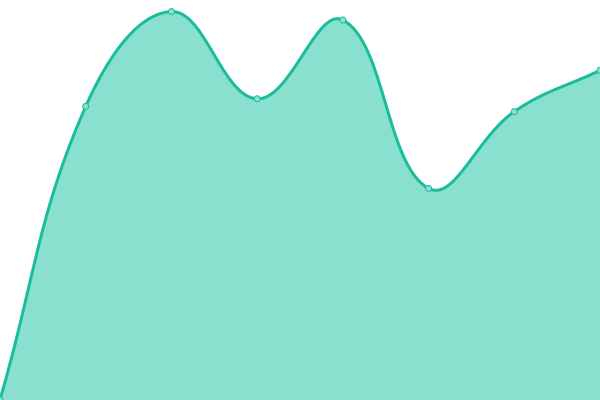
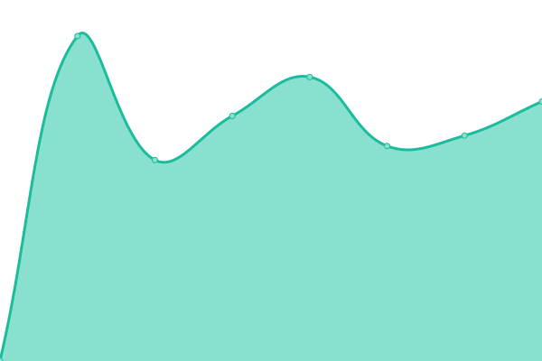

# [📈 Live Status](https://status.quakeworld.nu): <!--live status--> **🟩 All systems operational**

Status page for **QuakeWorld**, powered by [Upptime](https://github.com/upptime/upptime).

<!--start: status pages-->
<!-- This summary is generated by Upptime (https://github.com/upptime/upptime) -->
<!-- Do not edit this manually, your changes will be overwritten -->
<!-- prettier-ignore -->
| URL | Status | History | Response Time | Uptime |
| --- | ------ | ------- | ------------- | ------ |
|  [QuakeWorld.nu](https://www.quakeworld.nu) | 🟩 Up | [quake-world-nu.yml](https://github.com/quakeworldnu/status.quakeworld.nu/commits/HEAD/history/quake-world-nu.yml) | 

 1224ms
     
 | 

<a href="https://status.quakeworld.nu/history/quake-world-nu">99.91%</a>
    

|  [QuakeWorld Wiki](https://www.quakeworld.nu/wiki/Overview) | 🟩 Up | [quake-world-wiki.yml](https://github.com/quakeworldnu/status.quakeworld.nu/commits/HEAD/history/quake-world-wiki.yml) | 

 1154ms
     
 | 

<a href="https://status.quakeworld.nu/history/quake-world-wiki">99.91%</a>
    

|  [QuakeWorld GFX](https://gfx.quakeworld.nu) | 🟩 Up | [quake-world-gfx.yml](https://github.com/quakeworldnu/status.quakeworld.nu/commits/HEAD/history/quake-world-gfx.yml) | 

 687ms
     
 | 

<a href="https://status.quakeworld.nu/history/quake-world-gfx">99.92%</a>
    

|  [QuakeWorld Hub](https://hub.quakeworld.nu) | 🟩 Up | [quake-world-hub.yml](https://github.com/quakeworldnu/status.quakeworld.nu/commits/HEAD/history/quake-world-hub.yml) | 

 188ms
     
 | 

<a href="https://status.quakeworld.nu/history/quake-world-hub">100.00%</a>
    

|  [QuakeWorld Hub API](https://hubapi.quakeworld.nu/v2/servers/mvdsv) | 🟩 Up | [quake-world-hub-api.yml](https://github.com/quakeworldnu/status.quakeworld.nu/commits/HEAD/history/quake-world-hub-api.yml) | 

 699ms
     
 | 

<a href="https://status.quakeworld.nu/history/quake-world-hub-api">99.92%</a>
    

|  [QuakeWorld Duel Ranks](https://www.qwranks.com) | 🟩 Up | [quake-world-duel-ranks.yml](https://github.com/quakeworldnu/status.quakeworld.nu/commits/HEAD/history/quake-world-duel-ranks.yml) | 

 462ms
     
 | 

<a href="https://status.quakeworld.nu/history/quake-world-duel-ranks">100.00%</a>
    

|  [QuakeWorld Duel Ranks API](https://backend.qwranks.com/matches/0) | 🟩 Up | [quake-world-duel-ranks-api.yml](https://github.com/quakeworldnu/status.quakeworld.nu/commits/HEAD/history/quake-world-duel-ranks-api.yml) | 

 852ms
     
 | 

<a href="https://status.quakeworld.nu/history/quake-world-duel-ranks-api">100.00%</a>
    

|  [QHLAN.org](https://www.qhlan.org) | 🟩 Up | [qhlan-org.yml](https://github.com/quakeworldnu/status.quakeworld.nu/commits/HEAD/history/qhlan-org.yml) | 

 2010ms
     
 | 

<a href="https://status.quakeworld.nu/history/qhlan-org">99.93%</a>
    

|  [builds.quakeworld.nu](https://builds.quakeworld.nu) | 🟩 Up | [builds-quakeworld-nu.yml](https://github.com/quakeworldnu/status.quakeworld.nu/commits/HEAD/history/builds-quakeworld-nu.yml) | 

 768ms
     
 | 

<a href="https://status.quakeworld.nu/history/builds-quakeworld-nu">100.00%</a>
    

|  [maps.quakeworld.nu](https://maps.quakeworld.nu) | 🟩 Up | [maps-quakeworld-nu.yml](https://github.com/quakeworldnu/status.quakeworld.nu/commits/HEAD/history/maps-quakeworld-nu.yml) | 

 646ms
     
 | 

<a href="https://status.quakeworld.nu/history/maps-quakeworld-nu">100.00%</a>
    

<!--end: status pages-->
