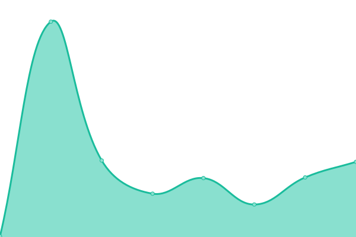

# [📈 Live Status](https://status.quakeworld.nu): <!--live status--> **🟩 All systems operational**

This repository contains the open-source uptime monitor and status page for [QuakeWorld.nu](https://www.quakeworld.nu/), powered by [Upptime](https://github.com/upptime/upptime).

With [Upptime](https://upptime.js.org), you can get your own unlimited and free uptime monitor and status page, powered entirely by a GitHub repository. We use [Issues](https://github.com/quakeworldnu/status.quakeworld.nu/issues) as incident reports, [Actions](https://github.com/quakeworldnu/status.quakeworld.nu/actions) as uptime monitors, and [Pages](https://status.quakeworld.nu) for the status page.

<!--start: status pages-->
<!-- This summary is generated by Upptime (https://github.com/upptime/upptime) -->
<!-- Do not edit this manually, your changes will be overwritten -->
<!-- prettier-ignore -->
| URL | Status | History | Response Time | Uptime |
| --- | ------ | ------- | ------------- | ------ |
|  [QuakeWorld.nu](https://www.quakeworld.nu) | 🟩 Up | [quake-world-nu.yml](https://github.com/quakeworldnu/status.quakeworld.nu/commits/HEAD/history/quake-world-nu.yml) | 

 1221ms
     
 | 

<a href="https://status.quakeworld.nu/history/quake-world-nu">100.00%</a>
    

|  [QuakeWorld Wiki](https://www.quakeworld.nu/wiki/Overview) | 🟩 Up | [quake-world-wiki.yml](https://github.com/quakeworldnu/status.quakeworld.nu/commits/HEAD/history/quake-world-wiki.yml) | 

 1069ms
     
 | 

<a href="https://status.quakeworld.nu/history/quake-world-wiki">100.00%</a>
    

|  [QuakeWorld GFX](https://gfx.quakeworld.nu) | 🟩 Up | [quake-world-gfx.yml](https://github.com/quakeworldnu/status.quakeworld.nu/commits/HEAD/history/quake-world-gfx.yml) | 

 603ms
     
 | 

<a href="https://status.quakeworld.nu/history/quake-world-gfx">100.00%</a>
    

|  [QuakeWorld Hub](https://hub.quakeworld.nu) | 🟩 Up | [quake-world-hub.yml](https://github.com/quakeworldnu/status.quakeworld.nu/commits/HEAD/history/quake-world-hub.yml) | 

 97ms
     
 | 

<a href="https://status.quakeworld.nu/history/quake-world-hub">100.00%</a>
    

|  [QuakeWorld Hub API](https://hubapi.quakeworld.nu/v2/servers/mvdsv) | 🟩 Up | [quake-world-hub-api.yml](https://github.com/quakeworldnu/status.quakeworld.nu/commits/HEAD/history/quake-world-hub-api.yml) | 

 811ms
     
 | 

<a href="https://status.quakeworld.nu/history/quake-world-hub-api">100.00%</a>
    

|  [QuakeWorld Duel Ranks](https://www.qwranks.com) | 🟩 Up | [quake-world-duel-ranks.yml](https://github.com/quakeworldnu/status.quakeworld.nu/commits/HEAD/history/quake-world-duel-ranks.yml) | 

 541ms
     
 | 

<a href="https://status.quakeworld.nu/history/quake-world-duel-ranks">100.00%</a>
    

|  [QHLAN.org](https://www.qhlan.org) | 🟩 Up | [qhlan-org.yml](https://github.com/quakeworldnu/status.quakeworld.nu/commits/HEAD/history/qhlan-org.yml) | 

 1903ms
     
 | 

<a href="https://status.quakeworld.nu/history/qhlan-org">100.00%</a>
    

<!--end: status pages-->

[**Visit our status website →**](https://status.quakeworld.nu)

## 📄 License

- Powered by: [Upptime](https://github.com/upptime/upptime)
- Code: [MIT](./LICENSE) © [QuakeWorld.nu](https://www.quakeworld.nu/)
- Data in the `./history` directory: [Open Database License](https://opendatacommons.org/licenses/odbl/1-0/)
